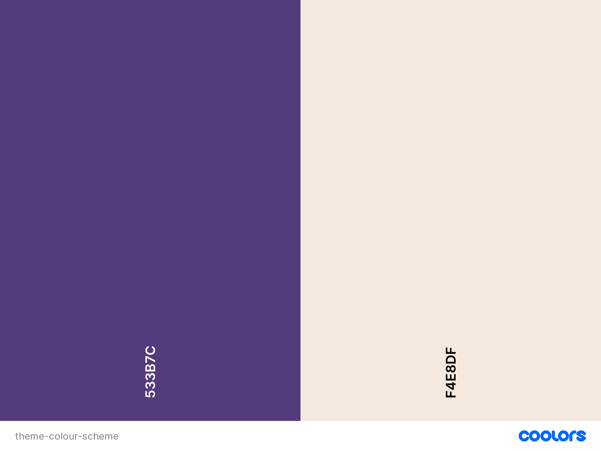

# Trivia Trumps Quiz

(Developer: Darrach Barneveld)

[Trivia Trumps Live Page](https://darrachbarneveld.github.io/Project-2-Code-Institute/)

Welcome to Trivia Trumps, where your knowledge will be put to the test across various categories. Answer easy, medium, and hard questions to earn bronze, silver, and gold medals respectively. As you conquer each category, you'll unlock powerful colourful trump card displayed in the trophy room. Get ready to embark on a thrilling trivia adventure and prove yourself as the ultimate champion in Trivia Trumps!
This was a particularly fun Javascript learning project as it showcases my passion for pub quizzes, knowledge and trump cards!

## Table of Contents

1. [Project Goals](#project-goals)
   1. [Business Goals](#business-goals)
   2. [User Goals](#user-goals)
2. [UX](#UX)
   1. [Target Audience](#target-audience)
   2. [User Requirements and Expectations](#user-requirements-and-expectations)
   3. [User Stories](#user-stories)
3. [Design](#design)
   1. [Design Choices](#design-choices)
   2. [Colours](#colours)
   3. [Fonts](#fonts)
   4. [Structure](#structure)
   5. [Wireframes](#wireframes)
4. [Technologies Used](#technologies-used)
   1. [Languages](#languages)
   2. [Frameworks & Tools](#frameworks--tools)
5. [Features](#features)
   1. [Current Features](#current-features)
   2. [Potential Features](#potential-features)
6. [Testing](#testing)
   1. [HTML Validation](#HTML-validation)
   2. [CSS Validation](#CSS-validation)
   3. [Accessibility](#accessibility)
   4. [Performance](#performance)
   5. [Device testing](#device-testing)
   6. [Browser compatibility](#browser-compatability)
   7. [Testing user stories](#testing-user-stories)
7. [Bugs](#Bugs)
8. [Deployment](#deployment)
9. [Credits](#credits)
10. [Acknowledgements](#acknowledgements)

## Project Goals

The primary goal of Trivia Trumps is to provide an entertaining and educational platform where players can test their knowledge, engage in friendly competition, and expand their understanding of various subjects.

### Business Goals

- Captivate and retain users by providing a highly engaging and addictive trivia experience
- Serve as an educational tool, encouraging players to expand their knowledge and learn new facts across a wide range of subjects
- To become an indispensable tool for pub quiz organizers and participants alike.

### User Goals

- Aim to challenge themselves and broaden their knowledge across various subjects
- Users seek a fun and engaging experience
- To engage in friendly competition with friends and family
- Players strive to earn medals, unlock trump cards, and achieve high scores, aiming for a sense of accomplishment and recognition
- Subscribe to a mailing list filled with content from scholars and researchers.

[Back to Table of Contents](#table-of-contents)

## UX

### Target Audience

- Trivia Enthusiasts: Individuals who have a passion for trivia
- Pub Quiz Participants: People who frequently engage in pub quizzes and trivia nights
- Knowledge Seekers: Individuals who have a strong desire to learn and expand their knowledge across various subjects
- Educational Institutions: Schools, colleges, and educational institutions
- Team Building Events: Companies and organizations that organize team building activities or corporate events

### User Requirements and Expectations

- Diverse and Challenging Questions: A wide range of well-crafted trivia questions that cover various subjects and difficulty levels.
- User-Friendly Interface: An intuitive and easy-to-navigate interface that allows for smooth gameplay, making it simple to select categories, answer questions, and track progress.
- Accurate and Reliable Information: Users expect the trivia questions to be accurate and up-to-date, ensuring that the provided information is trustworthy and reliable.
- Compatibility and Accessibility: Compatibility with various devices (mobile, tablet, desktop) and operating systems, as well as accessibility features to cater to individuals with different abilities, ensuring inclusivity and a broader user base.
- Progress Tracking and Achievement System: Features that allow them to track their progress, view their scores, and earn achievements or medals as a testament to their trivia skills and accomplishments.

### User Stories

#### Website/Business Owner:

1. Develop an engaging platform with diverse and challenging trivia questions across multiple categories.
2. Ensure a seamless user experience with an intuitive and visually appealing interface.
3. Implement a flexible and scalable architecture to accommodate future growth.
4. Track user progress, scores, and achievements to provide a personalized and rewarding experience.
5. I want to continuously improve the website design, functionality, and content, to meet the evolving needs and expectations of my audience and stay ahead of the competition.
6. Enable social integration features, such as leaderboards and multiplayer options, to foster community and friendly competition.
7. Implement effective marketing strategies to reach a wide audience and establish Trivia Trumps as a preferred trivia platform.

#### New Users:

1. As a new user, I want a user-friendly dashboard or homepage that provides clear navigation and options to explore different trivia categories and difficulty levels.
2. As a new user, I want access to a variety of beginner-level trivia questions to help me get started and gradually increase the difficulty as I become more comfortable and knowledgeable.
3. As a new user, I want an interactive onboarding tutorial or guide that familiarizes me with the gameplay mechanics, interface, and features of Trivia Trumps.

#### Existing Users:

1. As an existing user, I want the ability to access my previous game history and review my past scores, achievements, and progress.
2. As an existing user, I want regular updates with new trivia questions, categories, or game modes to keep the content fresh and provide ongoing challenges.
3. As an existing user, I want to be able to provide feedback or suggestions for improvement directly within the Trivia Trumps app or website, as I want to contribute to its ongoing development and enhancements.
4. As an existing user, I want the ability to share my achievements, high scores, or interesting trivia facts with my social networks directly from the Trivia Trumps platform.

[Back to Table of Contents](#table-of-contents)

## Design

### Design Choices

The initial design phase went through two stages. The initial inception of the trivia game was to be centred around Australia. The game was to have users answer questions about Australian wildlife and conquer the respective territories of Australia on an interactive map. You would collect Trump cards with information about the different states. This initial design choice can be seen in the final product. The design was also heavily inspired by trivia crack a mobile game as well as trivial pursuit. Players collect colourful segments and trump cards to conquer the wheel. Instead of states it is now category trump cards.

Some websites visited for reference are:

1. [Trivia Crack](https://triviacrack.com/)
2. [Australia Guide](https://www.australias.guide/qld/maps/)

### Colours

The Colour Scheme was based off the initial Trivia Crack game. [Trivia Crack](https://triviacrack.com/)

Main Colours - #3771b4 / #de3539 / #f4b335 / #6ec531 / #e36927 / #803788 / #66b9de / #ff69b4;

Theme Colours - #533b7c / #f4e8df

All colours were checked using [Accessible Webs Contrast Checker](https://accessibleweb.com/color-contrast-checker/). This ensured the page was compliant to WCAG AAA standards.

### Fonts

All fonts used were sourced and imported from [Google Fonts](https://fonts.google.com/) library.

All font used is Ubuntu with a sans-serif fallback.

### Structure

The main structure was designed with the mobile first development mindset in mind.

The site structure was inspired by reactive sites built with JS frameworks. I wanted a dynamic SPA feel to the user experience. The main page is a simple map/wheel with a scoreboard listing categories. I wanted users to interact with the elements on the page and choose segments to select categories. There is a simple header for navgation, main contents, and a footer. The game screen is dynamically generated depending on search parameters and the questions are shown 1 by 1.

### Index

1. Header/Navigation
2. Main Section / Wheel + Scoreboard
3. Footer

### Game

1. Header/Navigation
2. Main Section / Dynamic Questions. Inspired by the React Framework.
3. Footer

### Trophies

1. Header/Navigation
2. Main Section / Grid Trump card layout
3. Footer

There were also two further supplementary sections to provide a more well rounded experience. A 404 page was designed to route all traffic back to the home page if they visited an unknown url.

#### Header Section

1. Text Logo featured on the left of the header.
2. Navigation items to the left hand side.

#### Index Section

1. Large Map/Wheel interactive image featuring category segements. Located on the left
2. Scoreboard listing categories and medal count for each. Located on the right

#### Game Section

##### Pre-game

1. Category Logo image
2. Medal count
3. Form for difficulty selection
4. Start quiz and home navigation buttons

##### During-game

1. Category Logo image
2. Score and Question Count
3. Question
4. Answer buttons

#### Footer Section

1. Social Icons
2. Contact Information of the developer
3. Copywrite claims

### Wireframes

### Index

Mobile

iPad/Medium Screen

Desktop

### Game

Mobile

iPad/Medium Screen

Desktop

### Trophies

Mobile

iPad/Medium Screen

Desktop

[Back to Table of Contents](#table-of-contents)

## Technologies Used

### Languages

- HTML
- CSS
- Javascript

### Frameworks & Tools

- [Git](https://git-scm.com/)
- [GitHub](https://github.com/)
- [VS Code](https://code.visualstudio.com/)
- [Balsamiq - Wireframe](https://balsamiq.com/wireframes/)
- [Google Fonts](https://fonts.google.com/)
- [Font Awesome](https://fontawesome.com/)
- [Favicon.io - favicon generator](https://favicon.io/)
- [Coolors - Theme generator](https://coolors.co/)
- [Open Trivia Database](https://opentdb.com/api_config.php)
- [Chat-GPT](https://chat.openai.com/)
- [Google Lighthouse](https://developer.chrome.com/docs/lighthouse/overview/)
- [W3C Markup Validation Service](https://validator.w3.org/)
- [W3C CSS Validation Service](https://jigsaw.w3.org/css-validator/)
- [Wave Accessibility Tool](https://wave.webaim.org/)

[Back to Table of Contents](#table-of-contents)

## Features

### Current Features

### Logo and Navigation Bar

- Main header for all pages.
- Logo and navigation links which bring users to different page sections.
- How to play modal link

#### Desktop, Tablet & Larger Screens

#### Mobile and Smaller Screens

### Index Page

- Interactive navigation colour wheel with category tooltip for description
- Score Sheet with category medal list and links to quiz pages

#### Desktop, Tablet & Larger Screens

#### Mobile and Smaller Screens

### Game Page

#### Desktop, Tablet & Larger Screens

#### Tablet, Mobile and Smaller Screens

#### Pre-game

- Category Logo
- Medals obtained
- Difficulty selector
- Home and play buttons

#### During-game

- Questions
- Question Buttons

#### Post-game

- Potential Reward and Score
- Correct answer list
- Replay and return buttons

### Trophy Page

#### Desktop, Tablet & Larger Screens

#### Mobile and Smaller Screens

- 8 category trump cards listed
- Medal count and unlocked card status

### Footer

- Main footer for all pages.
- Logo and contact information
- Social icons for the web page
- Email contact form

#### Desktop, Tablet & Mobile

### 404 Page

- 404 page that shows when any non dedicated link is visited
- Has a navigation button back to the home page and tells the user that the page does not exist.
- Consistent header and footer from main index page.

#### Desktop & Larger Screens

#### Tablet, Mobile and Smaller Screens

### Potential Features

The following features could be implemented in the future but are beyond the scope of this project.

- Users can play against friends in a live play arena developed with socket.io or other libraries.
- Users can create more secure accounts with passwords and upload avatar icons or pictures
- Users can submit potential questions

[Back to Table of Contents](#table-of-contents)

## Testing

### HTML Validation

Validator W3 was used to validate the HTML of the website. All pages pass with no errors and no warnings shown.

- index.html [results](https://validator.w3.org/nu/?doc=https%3A%2F%2Fdarrachbarneveld.github.io%2FProject-1-Code-Institute%2F)
- success.html [results](https://validator.w3.org/nu/?doc=https%3A%2F%2Fdarrachbarneveld.github.io%2FProject-1-Code-Institute%2Fsuccess)
- 404.html results [results](https://validator.w3.org/nu/?doc=https%3A%2F%2Fdarrachbarneveld.github.io%2FProject-1-Code-Institute%2F404)

### CSS Validation

The W3C Jigsaw CSS Validation Service was used to validate the CSS of the website.

- styles.css [results](https://jigsaw.w3.org/css-validator/validator?uri=https%3A%2F%2Fdarrachbarneveld.github.io%2FProject-1-Code-Institute%2F&profile=css3svg&usermedium=all&warning=1&vextwarning=&lang=en)

### Accessibility

The WAVE WebAIM web accessibility evaluation tool was used to ensure the website met high accessibility standards. All pages pass with 0 errors.

- index.html [results](https://wave.webaim.org/report#/https://darrachbarneveld.github.io/Project-1-Code-Institute/)
- success.html [results](https://wave.webaim.org/report#/https://darrachbarneveld.github.io/Project-1-Code-Institute/success)
- 404.html results [results](https://wave.webaim.org/report#/https://darrachbarneveld.github.io/Project-1-Code-Institute/404)

### Performance

Google Lighthouse in Google's Chrome Developer Tools was used to test the performance of the website. All elements performed well.

### Index

Desktop

Mobile

### Success

Desktop

Mobile

### 404

Desktop

Mobile

### Device testing

The website was tested on the following devices:

#### Local

- MacBook Pro 2020
- Huawei P30
- Aztine 15.6 portable monitor

#### Cloud

- Tested using Google Chrome's Developer Tools to simulate all devices
- IPhone 10 - XCode simulator.

### Browser compatibility

The website was tested on the following browsers:

- Google Chrome 113.0.5672.63
- Mozilla Firefox 109.0
- Safari 13 Ventura

### Testing user stories

#### Website/Business Owner

- I want to test the site's usability and navigation, to ensure that users can easily find the information they need and navigate between pages.

  1. Users can navigate to any section by using the sticky header navigation.
  2. Users can navigate to any god description by clicking on the god card.

- I want to test the site's performance and loading speed, to ensure that it can handle a high volume of traffic and provide a smooth user experience.

  1. Site passing all performance testing metrics.

- I want to test the site's accessibility and compatibility, to ensure that it can be accessed on different devices and browsers, and that users with disabilities or special needs can use it effectively.

  1. Site is fully responsive across all platforms.
  2. Site is usable across all different browsers.
  3. Site passes all testing for accessibility.

- I want users to be able to contact me directly and sign up to subscription services.

  1. Working contact email as well as direct linking to social platforms.
  2. Subscription form works and shows users a success page.

- I want to make sure users are directed back to the index page of the website and not rely on the browser navigation to return to the home page.
  1. 404 page instructs the user the page doesn't exist and directs them back to the home page with a navigation button on the both header and below 404 text.

#### New Users:

- I want to immediately understand the content of the site so I can make a quick decision as to whether or not to continue.

  1. Hero text clearly states the purpose of the website
  2. First heading reinforces the context of the website.

- I want to be able to quickly navigate to desired areas of the website and find the information displayed clearly and concisely.

  1. Sticky navigation shows the key areas of the website.
  2. Clear and concise paragraphs outline the important points of each god. The who, what and where are all covered.

- I want to have multiple media sources displayed on the website I can get a comprehensive outlook on the information I require

  1. Youtube video media embedding an informative video
  2. Links to articles describing information in more detail
  3. High quality images and artist renditions of the mythical gods
  4. Map embedded to show location of the source material

#### Existing Users:

- I want to be able to sign up to a mailing list on the website so as to get alerts about future content.

  1. Mailing list form at the end of the page allows users to input their details.
  2. Choice of subscription gives the user control of the frequency of articles delivered.
  3. Success page is routed to upon completion of the form giving user feedback.

- I want to locate the contact details of the website owner so I can request assistance.

  1. Contact details located on the footer of the page show both the email, address, name and socials of the owner.

- I want to locate the contact details of the website owner so I can request assistance.
  1. Contact details located on the footer of the page show both the email, address, name and socials of the owner.

[Back to Table of Contents](#table-of-contents)

## Bugs

### MAJOR COMMIT ISSUE BUG SCREEN SHOTS

#### Total Commits

#### Registered Commits

| **Bug**                                                                                                                                                                                                                                                                             | **Fix**                                                                                                                                                                                                                                                   |
| ----------------------------------------------------------------------------------------------------------------------------------------------------------------------------------------------------------------------------------------------------------------------------------- | --------------------------------------------------------------------------------------------------------------------------------------------------------------------------------------------------------------------------------------------------------- |
| MAJOR BUG: COMMIT ISSUES - building this project was done using local VSCODE and the Live server extension. Files were then transfered to Gitpod to be pushed to repo. This was to avoid going over 50 hours. Difficulties pushing from local VS-Code meant this approach was used. | Bug not fixed. Unknown why all commits were not tracked. From the main screen commits are recorded but not listed on project repo commit total. Perhaps this was due to transfering files from local VS-Code to gitpod for commiting and pushing to repo. |
| Due to the hero image animation using CSS background url the image was unable to be optimised. This leads to high load times and poor performance.                                                                                                                                  | Using CSS media queries the hero image was disabled on mobile devices leading to better performance and lighthouse scores.                                                                                                                                |
| Embedding youtube videos and lead to large delays in performance. Reduce unused JavaScript, Javascript execution times and serving static assets were issues.                                                                                                                       | Following the tutorial on [Vumbnail](https://vumbnail.com/examples/srcdoc-iframe-for-lighthouse) I was able to drastically reduce performance issues by following the instructional srcdoc html setup.                                                    |
| Embedding Google Maps meant the certain errors were not able to be resolved. These were serving static assets with an efficient cache policy.                                                                                                                                       | Unfortunately no reasonable solution was found and this is a common error when embedding google maps. Without use of custom Javascript code which is beyond the scope of this project.                                                                    |

[Back to Table of Contents](#table-of-contents)

## Deployment

The website was deployed using GitHub Pages:

1. In the GitHub repository navigate to the Settings tab
2. On the left-hand menu select Pages
3. For the source select Branch: master
4. After the web page refreshes automatically you will see a ribbon on the top saying: Your site is live at https://darrachbarneveld.github.io/Project-2-Code-Institute/

You can for fork the repository:

1. Go to the GitHub repository
2. Click on Fork button in the upper right-hand corner
3. Edit the repository name and description if desired
4. Click the green create fork button

You can clone the repository:

1. Go to the GitHub repository
2. Locate the green Code button above the list of files and click it
3. Select if you prefer to clone using HTTPS, SSH, or Github CLI and click the copy button to copy the URL to your clipboard
4. Open Git Bash
5. Change the current working directory to the one where you want the cloned directory
6. Type git clone and paste the URL from the clipboard ($ git clone https://github.com/YOUR-USERNAME/YOUR-REPOSITORY)
7. Press Enter to create your local clone.

You can run this repository locally:

1. Go to the GitHub repository
2. Locate the green Code button above the list of files and click it
3. From the dropdown menu select download Zip.
4. Download and open the zip file to run in an editor

[Back to Table of Contents](#table-of-contents)

## Credits

### Images

- All Category Images by [FlatIcon](https://www.flaticon.com/icons)
    

Hero Background

    
    

- [Medal Images](https://www.hiclipart.com/free-transparent-background-png-clipart-pwwor) by [HiClipArt](www.hiclipart.com)
  

Hero Image

  
  

### Icons

- All Icons Are sourced from [FontAwesome](https://fontawesome.com/icons)

### Questions

- [Open Trivia Database](https://opentdb.com/api_config.php)

### Code

- SVG colour wheel was learned from [FreeCodeCamp](https://www.freecodecamp.org/news/how-to-make-clickable-svg-map-html-css/)
- Tooltip Design [W3Schools](https://www.w3schools.com/css/css_tooltip.asp#:~:text=A%20tooltip%20is%20often%20used,Bottom)
- Popup Modal [W3Schools](https://www.w3schools.com/howto/howto_css_modals.asp)
- Dynamic Page Rendering based on query string [Stack Overflow](https://stackoverflow.com/questions/901115/how-can-i-get-query-string-values-in-javascript)
- Immediate execution of functions for dynamic page render[Stack Overflow](https://stackoverflow.com/questions/11936816/execute-function-after-complete-page-load)
- Indepth understanding of local storage for game stats [MDN](https://developer.mozilla.org/en-US/docs/Web/API/Window/localStorage)

## Acknowledgements

I would like to make the following thanks to all that helped me on this project:

- My mentor Adegbenga Adeye for suggestions for improvements. Showing me how to use tooltips for greater UI. The post quiz scores and correct answers feature.
- Alan Bushelland the April 2023 Student Cohort for their continued support and feedback on my projects
- Tanguy L'Alexandre, Ivette Mc Dermott, Georgina_5P, Ian Bowell, Devan_Cadman_4P for their peer review suggestions

[Back to Table of Contents](#table-of-contents)
